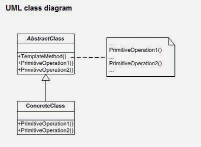

### 디자인 패턴

#### Singleton 패턴
- Creational Pattern, 생성 패턴
- 인스턴스가 하나뿐인 특별한 객체를 만들 수 있게 해주는 디자인 패턴
- 생성자가 private으로 지정되어있다.
- 즉 인스턴스를 직접 만드는것이 아니라 인스턴스를 "달라고 요청"하는 것
- 문제점
    - 단일 스레드라면 문제가 없겠지만 스레드가 여러개인 경우(멀티 스레드) 의도치 않게 여러개의 객체가 만들어질 수 있다.
- 해결방법
    - 인스턴스를 반환하는 메서드를 동기화(synchronized) 시키면 간단하게 해결할 수 있다.
    - 하지만 동기화가 꼭 필요한 시점은 해당 메서드가 시작되는 순간 뿐이다.
- 효율적인 해결방법
    1. 인스턴스를 필요할 때 생성하는 것이 아닌, 처음부터 만들어 버린다.(static)
        - static을 사용하면 클래스가 로딩될 때 JVM에서 Singleton의 유일한 인스턴스를 생성해준다.
    2. Double Checking Locking (DCL)을 사용해 동기화되는 부분을 줄인다.
        - DCL을 사용하면 일단 인스턴스가 생성되어 있는지 확인한 다음, 생성되어 있지 않은 경우에만 동기화를 할 수 있다.
        - 다만 DCL은 자바 1.5버전 부터 사용할 수 있다.
- 스프링은 기본적으로 별다른 설정을 하지 않으면 내부에서 생성하는 빈 오브젝트를 모두 싱글톤으로 만든다.
    - 엄밀히 말하자면 스프링은 직접 싱글톤 형태의 오브젝트를 만들고 관리하는 기능을 제공한다. -> 싱글톤 레지스트리
    - [출처](http://blog.naver.com/PostView.nhn?blogId=kjy6268&logNo=50107958407)

```java
public class singleton {
    private volatile static Singleton uniqueInstance; 
    // volatile 키워드를 사용하면 멀티스레딩을 쓰더라도 
    // uniqueInstance변수가 Singleton 인스턴스를 초기화 되는 과정이 
    // 올바르게 진행되도록 할 수 있다.
    private Singleton() {}
    public static Singleton getUniqueInstance() {
        if(uniqueInstance == null){
            synchronized (Singleton.class) {
                if (uniqueInstance == null) {
                    uniqueInstance = new Singleton();
                }
            }
        }
        return uniqueInstance;
    }
}
```


#### 템플릿 메소드 패턴
- Behavioral Pattern, 행위 패턴
- 일련의 알고리즘의 여러 단계 가운데 하나 이상이 추상 메소드로 정의되며, 그 추상 메소드는 서브 클래스에서 구현이 되는 패턴
- 템플릿 메소드 패턴을 사용하면 서브클래스에서 일부분을 구현할 수 있으면서 알고리즘의 구조는 바꾸지 않아도 된다.
    - TL:DR: 전체적으로는 동일하면서 부분적으로는 다른 구문으로 구성된 메서드의 코드 중복을 최소화 할 때 유용하다.
    - 다른 관점에서 보면 동일한 기능을 상위 클래스에서 정의하면서 확장/변화가 필요한 부분만 서브 클래스에서 구현할 수 있도록 한다.
    - 예를 들어, 전체적인 알고리즘은 상위 클래스에서 구현하면서 다른 부분은 하위 클래스에서 구현할 수 있도록 함으로써 전체적인 알고리즘 코드를 재사용하는 데 유용하도록 한다.
- 
    - AbstractClass
        - AbstractClass는 템플릿 메소드를 정의하는 클래스
        - abstract 메소드로 선언된 단계(메소드)들이 템플릿 메소드에서 활용된다.
        - 하위 클래스에 공통 알고리즘을 정의하고 하위 클래스에서 구현될 기능을 primitive혹은 hook 메소드로 정의하는 클래스이다.
    - ConcreteClass
        - 물려받은 primitive 혹은 hook 메소드를 구현하는 클래스
        - 상위 클래스에 구현된 템플릿 메소드의 일반적인 알고리즘에서 하위 클래스에 적합하게 primitive 메소드나 hook메소드를 오버라이드 하는 클래스
        
- 행위(Behavioral) 패턴
    - 객체나 클래스 사이의 알고리즘이나 책임 분배에 관련된 패턴
    - 한 객체가 혼자 수행할 수 없는 작업을 여러 개의 객체로 어떻게 분배하는지, 또 그렇게 하면서도 객체 사이의 결합도를 최소화하는 것에 중점을 둔다.