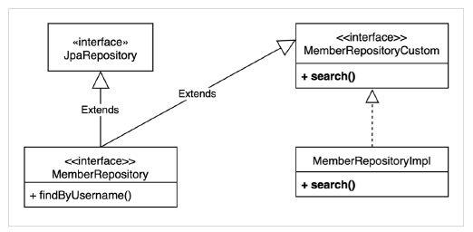

#### JPA
##### JAVA PERSISTENCE API
- 자바 진영의 ORM 표쥰 기술

#### ORM
##### Object Relational MApping
- 객체는 객체대로, 관계형 DB는 관계형 DB대로 설계
- ORM 프레임워크가 중간에서 Mapping해준다.

##### JPA는  JAVA Application과 JDBC 사이에서 동작한다.
### 가장 핵심적인 부분은 바로 패러다임 불일치를 해결해준다는것.

#### JPA 사용 이유
- 생산성 증가.
    - CRUD가 편하다.
    - 유지보수가 편하다.
        - 기존: 필드 변경시 모든 SQL을 수정해야 했다.
        - JPA: 필드만 추가 해주면 알아서 해결 해준다.
    - 패러다임 불일치 해결
    - JPA를 통한 자유로운 객체 그래프 탐색
    - 동일한 트랜잭션에서 조회한 Entity는 같음을 보장한다.
    

    
--------
    
### 아래 정리글은 김연한님의 인프런 강의 [실전! Querydsl](https://www.inflearn.com/course/Querydsl-%EC%8B%A4%EC%A0%84#) 을 보고 나름대로 정리한 내용을 올린 글입니다. Querydsl과 JPA를 좀 더 자세히 알고싶으신 분들은 해당 강의를 직접 들으시는것을 추천합니다.

---------

#### 순수 JPA Repository와 Querydsl
```java
//순수 JPA Repository
import com.querydsl.core.BooleanBuilder;
import com.querydsl.core.types.dsl.BooleanExpression;
import com.querydsl.jpa.impl.JPAQueryFactory;
import org.springframework.stereotype.Repository;
import study.querydsl.dto.MemberSearchCondition;
import study.querydsl.dto.MemberTeamDto;
import study.querydsl.dto.QMemberTeamDto;
import study.querydsl.entity.Member;
import javax.persistence.EntityManager;
import java.util.List;
import java.util.Optional;
import static org.springframework.util.StringUtils.hasText;
import static org.springframework.util.StringUtils.isEmpty;
import static study.querydsl.entity.QMember.member;
import static study.querydsl.entity.QTeam.team;
@Repository
public class MemberJpaRepository {
	
	private final EntityManager em;
	private final JPAQueryFactory queryFactory;
	
	public MemberJpaRepository(EntityManager em) {
		this.em = em;
		this.queryFactory = new JPAQueryFactory(em);
	}
	
	public void save(Member member) {
		em.persist(member);
	}
	
	public Optional<Member> findById(Long id) {
		Member findMember = em.find(Member.class, id);
		return Optional.ofNullable(findMember);
	}
	
	public List<Member> findAll() {
		return em.createQuery("select m from Member m", Member.class).getResultList();
	}
	
	public List<Member> findByUsername(String username) {
		return em.createQuery("select m from Member m where m.username= :username", Member.class).setParameter("username", username).getResultList();
	}
}
```
##### 순수 JPA Repository -> Spring Data JPA Repository
- interface로 변경 후 extends JpaRepository<> 추가
- 간단한 정적 쿼리는 Spring Data JPA가 이름으로 매칭해서 자동으로 구현해준다.
```java
@Repository
public interface MemberRepository extends JpaRepository<Member, Long> {	
	List<Member> findByUsername(String username);
}
```

- 복잡한 쿼리를 실행하거나 cunstom 기능이 필요한 경우 사용자 정의 Repository를 만들어 사용한다.

1. 사용자 정의 인터페이스 작성
2. 사용자 정의 인터페이스 구현
3. Spring Data Repository에 사용자 정의 인터페이스 상속

```java
//사용자 정의 인터페이스 작성
import study.querydsl.dto.MemberSearchCondition;
import study.querydsl.dto.MemberTeamDto;
import java.util.List;
public interface MemberRepositoryCustom {
  List<MemberTeamDto> search(MemberSearchCondition condition);
}
```

```java
//사용자 정의 인터페이스 구현
import com.querydsl.core.types.dsl.BooleanExpression;
import com.querydsl.jpa.impl.JPAQueryFactory;
import study.querydsl.dto.MemberSearchCondition;
import study.querydsl.dto.MemberTeamDto;
import study.querydsl.dto.QMemberTeamDto;
import javax.persistence.EntityManager;
import java.util.List;
import static org.springframework.util.StringUtils.isEmpty;
import static study.querydsl.entity.QMember.member;
import static study.querydsl.entity.QTeam.team;
public class MemberRepositoryImpl implements MemberRepositoryCustom {
  private final JPAQueryFactory queryFactory;
  public MemberRepositoryImpl(EntityManager em) {
    this.queryFactory = new JPAQueryFactory(em);
  }
  @Override
  //회원명, 팀명, 나이(ageGoe, ageLoe)
  public List<MemberTeamDto> search(MemberSearchCondition condition) {
    return queryFactory
            .select(new QMemberTeamDto(
                    member.id.as("memberId"),
                    member.username,
                    member.age,
                    team.id.as("teamId"),
                    team.name.as("teamName")))
            .from(member)
            .leftJoin(member.team, team)
            .where(usernameEq(condition.getUsername()),
                    teamNameEq(condition.getTeamName()),
                    ageGoe(condition.getAgeGoe()),
                    ageLoe(condition.getAgeLoe()))
            .fetch();
  }
  private BooleanExpression usernameEq(String username) {
    return isEmpty(username) ? null : member.username.eq(username);
  }
  private BooleanExpression teamNameEq(String teamName) {
    return isEmpty(teamName) ? null : team.name.eq(teamName);
  }
  private BooleanExpression ageGoe(Integer ageGoe) {
    return ageGoe == null ? null : member.age.goe(ageGoe);
  }
  private BooleanExpression ageLoe(Integer ageLoe) {
    return ageLoe == null ? null : member.age.loe(ageLoe);
  }
}
```

```java
//스프링 데이터 리포지토리에 사용자 정의 인터페이스 상속
import org.springframework.data.jpa.repository.JpaRepository;
import study.querydsl.entity.Member;
import java.util.List;
public interface MemberRepository extends JpaRepository<Member, Long>,MemberRepositoryCustom {
  List<Member> findByUsername(String username);
}
```

##### Spring Data Paging
- offset -> pageable.getOffset(); -> 몇번째부터 조회를 시작할지
- limit -> pageable.getPageSize(); -> 한 번 조회시 몇개까지 조회할지

```java
//사용자 정의 interface에 페이징 2가지 추가
import org.springframework.data.domain.Page;
import org.springframework.data.domain.Pageable;
import study.querydsl.dto.MemberSearchCondition;
import study.querydsl.dto.MemberTeamDto;
import java.util.List;
public interface MemberRepositoryCustom {
  List<MemberTeamDto> search(MemberSearchCondition condition);
  Page<MemberTeamDto> searchPageSimple(MemberSearchCondition condition,Pageable pageable);
  Page<MemberTeamDto> searchPageComplex(MemberSearchCondition condition,Pageable pageable);
}
```
- 전체 카운트를 한번에 조회하는 단순한 방법: fetchResults()
    - Querydsl이 count 쿼리와 contents용 쿼리를 함께 날린다.
    
```java
/**
* 단순한 페이징, fetchResults() 사용
*/
@Override
public Page<MemberTeamDto> searchPageSimple(MemberSearchCondition condition,Pageable pageable) {
  QueryResults<MemberTeamDto> results = queryFactory
          .select(new QMemberTeamDto(
                  member.id.as("memberId"),
                  member.username,
                  member.age,
                  team.id.as("teamId"),
                  team.name.as("teamName")))
          .from(member)
          .leftJoin(member.team, team)
          .where(usernameEq(condition.getUsername()),
                  teamNameEq(condition.getTeamName()),
                  ageGoe(condition.getAgeGoe()),
                  ageLoe(condition.getAgeLoe()))
          .offset(pageable.getOffset())
          .limit(pageable.getPageSize())
          .fetchResults();
  List<MemberTeamDto> content = results.getResults();
  long total = results.getTotal();
  return new PageImpl<>(content, pageable, total);
}
```
- fetchResult() 는 카운트 쿼리 실행시 필요없는 order by 는 제거한다.

- count 쿼리의 분리
    - content 쿼리는 복잡하지만 count 쿼리는 단순한 경우에 유용하다.
        - fetchResults()를 사용하면 쿼리에 있는 조건문이 content쿼리와 count쿼리에 모두 붙게 되어 최적화가 힘들다.
            - count 쿼리를 분리해서 사용
```java
/**
* 복잡한 페이징
* 데이터 조회 쿼리와, 전체 카운트 쿼리를 분리
*/
@Override
public Page<MemberTeamDto> searchPageComplex(MemberSearchCondition condition,Pageable pageable) {
  List<MemberTeamDto> content = queryFactory
          .select(new QMemberTeamDto(
                  member.id.as("memberId"),
                  member.username,
                  member.age,
                  team.id.as("teamId"),
                  team.name.as("teamName")))
          .from(member)
          .leftJoin(member.team, team)
          .where(usernameEq(condition.getUsername()),
                  teamNameEq(condition.getTeamName()),
                  ageGoe(condition.getAgeGoe()),
                  ageLoe(condition.getAgeLoe()))
          .offset(pageable.getOffset())
          .limit(pageable.getPageSize())
          .fetch();
  long total = queryFactory
          .select(member)
          .from(member)
          .leftJoin(member.team, team)
          .where(usernameEq(condition.getUsername()),
                  teamNameEq(condition.getTeamName()),
                  ageGoe(condition.getAgeGoe()),
                  ageLoe(condition.getAgeLoe()))
          .fetchCount();
  return new PageImpl<>(content, pageable, total);
}
```

##### Count 쿼리 최적화
- count 쿼리가 생략 가능한 경우
    - page의 시작이면서 content 사이즈가 page 사이즈보다 작은 경우
    - 마지막 page인 경우 (offset + content size = total size)
```java
  JPAQuery<Member> countQuery = queryFactory
          .select(member)
          .from(member)
          .leftJoin(member.team, team)
          .where(usernameEq(condition.getUsername()),
                  teamNameEq(condition.getTeamName()),
                  ageGoe(condition.getAgeGoe()),
                  ageLoe(condition.getAgeLoe()));
  // return new PageImpl<>(content, pageable, total);
  return PageableExecutionUtils.getPage(content, pageable,countQuery::fetchCount);
```
- PageableExecutionUtils.getPage()
    - count 쿼리 생략 가능한 경우에는 함수(이 경우 countQuery::fetchCount) 호출을 하지 않는다.
    
##### Controller 개발
```java
//실제 컨트롤러
import lombok.RequiredArgsConstructor;
import org.springframework.data.domain.Page;
import org.springframework.data.domain.Pageable;
import org.springframework.web.bind.annotation.GetMapping;
import org.springframework.web.bind.annotation.RestController;
import study.querydsl.dto.MemberSearchCondition;
import study.querydsl.dto.MemberTeamDto;
import study.querydsl.repository.MemberJpaRepository;
import study.querydsl.repository.MemberRepository;
import java.util.List;
@RestController
@RequiredArgsConstructor
public class MemberController {
  private final MemberJpaRepository memberJpaRepository;
  private final MemberRepository memberRepository;
  @GetMapping("/v1/members")
  public List<MemberTeamDto> searchMemberV1(MemberSearchCondition condition){
    return memberJpaRepository.search(condition);
  }
  @GetMapping("/v2/members")
  public Page<MemberTeamDto> searchMemberV2(MemberSearchCondition condition,Pageable pageable) {
    return memberRepository.searchPageSimple(condition, pageable);
  }
  @GetMapping("/v3/members")
  public Page<MemberTeamDto> searchMemberV3(MemberSearchCondition condition,Pageable pageable) {
    return memberRepository.searchPageComplex(condition, pageable);
  }
}
```

```
http://localhost:8080/v2/members?size=5&page=2
```

##### Querydsl 지원 Class 직접 생성
- QuerydslRepositorySupport가 지닌 한계를 극복하기 위해 사용한다.
    - QuerydslRepositorySupport가 지닌 한계
        - Querydsl 4.x에 나온 JPAQueryFactory로 시작할 수 없기 때문에 select로 시작할 수 없음 (from으로 시작해야함)
        - QueryFactory를 제공하지 않는다.
        - Spring Data Sort가 정상 작동하지 않는다.
```java
import com.querydsl.core.types.EntityPath;
import com.querydsl.core.types.Expression;
import com.querydsl.core.types.dsl.PathBuilder;
import com.querydsl.jpa.impl.JPAQuery;
import com.querydsl.jpa.impl.JPAQueryFactory;
import org.springframework.beans.factory.annotation.Autowired;
import org.springframework.data.domain.Page;
import org.springframework.data.domain.Pageable;
import org.springframework.data.jpa.repository.support.JpaEntityInformation;
import
org.springframework.data.jpa.repository.support.JpaEntityInformationSupport;
import org.springframework.data.jpa.repository.support.Querydsl;
import org.springframework.data.querydsl.SimpleEntityPathResolver;
import org.springframework.data.repository.support.PageableExecutionUtils;
import org.springframework.stereotype.Repository;
import org.springframework.util.Assert;
import javax.annotation.PostConstruct;
import javax.persistence.EntityManager;
import java.util.List;
import java.util.function.Function;
/**
* Querydsl 4.x 버전에 맞춘 Querydsl 지원 라이브러리
*
* @author Younghan Kim
* @see
org.springframework.data.jpa.repository.support.QuerydslRepositorySupport
제공하는 기능:
1. 스프링 데이터가 제공하는 페이징을 편리하게 변환
2. 페이징과 카운트 쿼리 분리 가능
3. 스프링 데이터 Sort 지원
4. select() , selectFrom() 으로 시작 가능
5. EntityManager , QueryFactory 제공
*/
@Repository
public abstract class Querydsl4RepositorySupport {
  private final Class domainClass;
  private Querydsl querydsl;
  private EntityManager entityManager;
  private JPAQueryFactory queryFactory;
  public Querydsl4RepositorySupport(Class<?> domainClass) {
    Assert.notNull(domainClass, "Domain class must not be null!");
    this.domainClass = domainClass;
  }
  @Autowired
  public void setEntityManager(EntityManager entityManager) {
    Assert.notNull(entityManager, "EntityManager must not be null!");
    JpaEntityInformation entityInformation = JpaEntityInformationSupport.getEntityInformation(domainClass, entityManager);
    SimpleEntityPathResolver resolver = SimpleEntityPathResolver.INSTANCE;
    EntityPath path = resolver.createPath(entityInformation.getJavaType());
    this.entityManager = entityManager;
    this.querydsl = new Querydsl(entityManager, new PathBuilder<>(path.getType(), path.getMetadata()));
    this.queryFactory = new JPAQueryFactory(entityManager);
  }
  @PostConstruct
  public void validate() {
    Assert.notNull(entityManager, "EntityManager must not be null!");
    Assert.notNull(querydsl, "Querydsl must not be null!");
    Assert.notNull(queryFactory, "QueryFactory must not be null!");
  }
  protected JPAQueryFactory getQueryFactory() {
    return queryFactory;
  }
  protected Querydsl getQuerydsl() {
    return querydsl;
  }
  protected EntityManager getEntityManager() {
    return entityManager;
  }
  protected <T> JPAQuery<T> select(Expression<T> expr) {
    return getQueryFactory().select(expr);
  }
  protected <T> JPAQuery<T> selectFrom(EntityPath<T> from) {
    return getQueryFactory().selectFrom(from);
  }
  protected <T> Page<T> applyPagination(Pageable pageable,Function<JPAQueryFactory, JPAQuery> contentQuery) {
    JPAQuery jpaQuery = contentQuery.apply(getQueryFactory());
    List<T> content = getQuerydsl().applyPagination(pageable, jpaQuery).fetch();
    return PageableExecutionUtils.getPage(content, pageable, jpaQuery::fetchCount);
  } 
  protected <T> Page<T> applyPagination(Pageable pageable, Function<JPAQueryFactory, JPAQuery> contentQuery, Function<JPAQueryFactory, JPAQuery> countQuery) {
    JPAQuery jpaContentQuery = contentQuery.apply(getQueryFactory());
    List<T> content = getQuerydsl().applyPagination(pageable, jpaContentQuery).fetch();
    JPAQuery countResult = countQuery.apply(getQueryFactory());
    return PageableExecutionUtils.getPage(content, pageable, countResult::fetchCount);
  }
}
```
- 위와 같은 방법으로 직접 지원  Class를 생성해 사용할 수 있다.