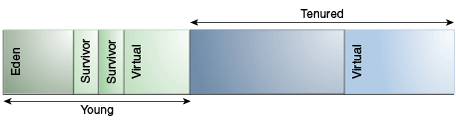
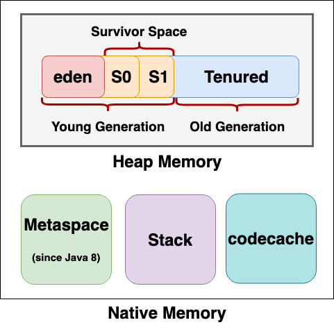
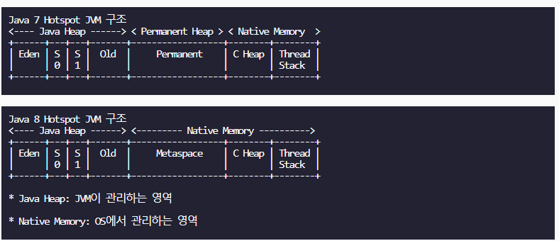
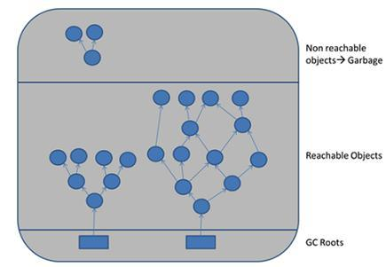

### 자바
####  Java 란 무엇인가
* 운영체제에 종속되지 않고 애플리케이션을 개발할 수 있는 객체 지향적 프로그래밍 언어.
#### Java SE와 Java EE 애플리케이션 차이
* https://www.ibm.com/support/knowledgecenter/ko/SSQP76_8.9.1/com.ibm.odm.dserver.rules.res.managing/topics/con_javase_javaee_applis.html
* Java Standard Editon
    - 가장 보편적으로 쓰이는 자바 API집합체.
    - 각종 자료구조, 기본 유틸리티, 스윙이나 AWT와 같은 GUI도구등의 기본기능을 포함하고 있다.
* Java Enterprise Edition
        - 엔터프라이즈 환경을 위한 도구로 EJB, JSP, Servlet, JNDI같은 기능을 지원하며 웹 애플리케이션 서버를 이용하는 프로그램 개발시 많이 사용한다.
#### java와 c/c++의 차이점
#### java의 접근 제어자의 종류와 특징
* public - public 접근 제어자가 붙은 변수, 메소드는 어떤 클래스에서도 접근이 가능하다.
* private - private 접근 제어자가 붙은 변수, 메소드는 자신이 선언 된 클래스에서만 접근이 가능하다. 
* protected - protected 접근 제어자가 붙은 변수, 메소드는 동일 패키지내의 클래스, 혹은 해당 클래스를 상속받은 외부 패키지의 클래스에서 접근이 가능하다.
* default - 접근 제어자를 별도로 설정하지 않은 변수 메소드는 자동으로 default 접근 제어자가 붙고, 이들은 자신들이 속한 패키지 내에서만 접근이 가능하다.
- https://wikidocs.net/232
#### OOP의 4가지 특징
* 추상화 -  공통된 행동(Method)이나 속성(Field)을 모아서 클래스를 만드는 것
* 캡슐화 - 객체의 행동(Method), 속성(Field)을 하나로 묶고, 실제 구현 내용을 감추는 것.
    * 필드 변수 앞에 접근 제어자 private을 붙인다.
    * 필드 변수에 값을 넣고 가져올 수 있는 메소드를 만든다. (Getter/Setter)
* 상속 - 상위 객체가 자신이 가지고 있는 필드와 메소드를 하위 객체에게 물려주어 하위 객체가 사용할 수 있도록 하는것
* 다형성 - 같은 타입이지만 실행 결과가 다양햔 객체를 이용할 수 있는 성질
- https://github.com/irerin07/java_study#%EA%B0%9D%EC%B2%B4-%EC%A7%80%ED%96%A5-%ED%94%84%EB%A1%9C%EA%B7%B8%EB%9E%98%EB%B0%8D%EC%9D%98-%ED%8A%B9%EC%A7%95
#### OOP의 5대 원칙
* S - 단일 책임 원칙(SRP, Single Responsibility Principle): 객체는 단 하나의 책임만 가져야 한다.
* O - 개방-폐쇄 원칙(OCP, Open Closed Principle): 확장에는 열려있어야 하지만 기존 코드의 수정에는 닫혀있어야 한다.
* L - 리스코프 치환 원칙(LSP, Liskov Substitution Principle): 자식 클래스는 언제나 부모 클래스를 대체할 수 있다.
* I - 인터페이스 분리 원칙(ISP, Interface Segregation Principle): 인터페이스를 클라이언트에 특화되도록 분리시키라는 설계 원칙이다.
* D - 의존 역전 원칙(DIP, Dependency Inversion Principle): 의존 관계를 맺을 때 변화하기 쉬운 것 또는 자주 변화하는 것보다는 변화하기 어려운 것, 거의 변화가 없는 것에 의존하라는 것이다.
* https://irerin07.tistory.com/4
    
* 단일 책임 원칙과 의존 역전 원칙
    *  
    
#### 자바는 Call By Value인가 Call By Reference인가
- 자바는 기본적으로 Call By Value이다.
    - http://mussebio.blogspot.com/2012/05/java-call-by-valuereference.html 
    - https://stackoverflow.com/questions/40480/is-java-pass-by-reference-or-pass-by-value/12429953#12429953
    
#### 오버로딩과 오버라이딩의 차이(Overloading vs Overriding)
#### String, StringBuilder, StringBuffer
- String
    - immutable, 불변. 한 번 String Pool 이라는 공간에 생성되면 그 인스턴스의 메모리 공간은 변경될 수 없다.
        - private final char[]의 형태를 가진다.
            - private: 외부에서 접근 불가
            - final: 초기값 변경 불가
    - "+" 혹은 .concat()을 사용하면 새로운 String 인스턴스를 만들고 그 안에 연결 된 문자열을 저장후 참조하게 한다.
    - 문자열을 합치면 기존에 생성되었던 인스턴스는 GC의 대상이 된다. 
        - 각각의 String 주소값이 Stack에 쌓이고, GC가 호출되기 전까지 생성된 String 객체들은 Heap에 쌓이기 때문에 메모리 관리에 치명적이다.
    - 문자열 연산이 적고 참조가 많이 있는 경우 사용하기 좋으며 Thread-safe 하다.
- StringBuilder
    - mutable, 가변. 연산을 할 때 클래스는 한 번 만들고, 메모리 값을 변경시켜서 문자열을 변경한다.
    - 문자열 연산 등으로 기존 객체에 공간이 부족하게 되는 경우, 기존의 버퍼 크기를 늘리며 유연하게 동작
    - StringBuffer와 StringBuilder 클래스가 제공하는 메서드는 서로 동일
    - 동기화를 보장하지 않음
- StringBuffer
   - mutable, 가변. 연산을 할 때 클래스는 한 번 만들고, 메모리 값을 변경시켜서 문자열을 변경한다.
   - 문자열 연산 등으로 기존 객체에 공간이 부족하게 되는 경우, 기존의 버퍼 크기를 늘리며 유연하게 동작
   - StringBuffer와 StringBuilder 클래스가 제공하는 메서드는 서로 동일
   - StringBuffer는 각 메서드별로 Synchronized Keyword가 존재하여, 멀티스레드 환경에서도 동기화를 지원

#### Java Reflection
- Java에는 Class라는 이름의 클래스가 존재한다.
- Class는 런타임에 존재하는 모든 클래스와 객체들의 정보를 가지고 있다.
- Class의 객체는 특정 클래스의 프로퍼티(생성자, 필드, 메소드)를 가지고 있으며 이 객체들을 이용하여 reflection을 실행하게 된다.
- Reflection은 구체적인 클래스 타입을 알지 못해도 그 클래스의 내부 정보에 접근, 조회, 수정할 수 있는 기법을 말한다. 
    - 구체적인 클래스 타입을 알지 못하면 해당 클래스의 메소드, 타입, 변수들에 접근할 수가 없다.
```java
public class ReflectionExample{
  public static void main(String[] args){
      Object robot = new Robot();
      robot.move(); // 컴파일 에러 발생
  }
}
class Robot{
  public void move(){
      //doSomeThing
  }
}
```
- 모든 클래스의 조상 클래스인 Object 타입으로 Robot클래스의 인스턴스를 만들었지만 사용할 수 있는 메소드는 Object의 메소드뿐이다.
    - 이런식으로 객체의 구체적인 Class를 모든다면 해당 Class의 메소드와 변수는 사용할 수 없다.
    - 형변환을 사용하면 해당 클래스의 메소드와 변수에 접근할 수 있다. 
    - eg) Robot newRobot = (Robot)robot;  
    newRobot.move();
    
    
- [리플렉션(getMethod())을 사용해 public 메소드 불러오기](http://www.avajava.com/tutorials/lessons/how-do-i-call-a-method-using-reflection.html)
- [리플렉션(getDeclaredMethod())을 사용해 private/protected 메소드 불러오기](http://www.avajava.com/tutorials/lessons/how-do-i-call-a-declared-method-using-reflection.html)
- [리플렉션(getField()/ set())을 사용해 필드 불러오고 설정하기](http://www.avajava.com/tutorials/lessons/how-do-i-get-and-set-a-field-using-reflection.html)
- [리플렉션(getDeclaredField()/ set())을 사용해 필드 불러오고 설정하기](http://www.avajava.com/tutorials/lessons/how-do-i-get-and-set-a-declared-field-using-reflection.html)
- [리플렉션(getDeclaredConstructor()/getConstructor())을 사용해 생성자로 객체 생성하기](http://www.avajava.com/tutorials/lessons/how-do-i-create-an-object-via-its-multiparameter-constructor-using-reflection.html)
    
#### Garbage Collection 가비지 콜렉션 Java 8
- 가비지/ Garbage?
    - 실행중인 프로그램의 어떤 포인터로도 접근할 수 없는 객체를 Garbage로 간주합니다.
    - [An object is considered garbage when it can no longer be reached from any pointer in the running program.](https://docs.oracle.com/javase/8/docs/technotes/guides/vm/gctuning/generations.html) 
- 가장 단순한 GC알고리즘은 접근이 가능한 모든 객체를 순회한 뒤에 남아있는 객체를 Garbage로 판단하는 방식이다.
    - 이 방법은 살아있는 객체의 수에 비례하는 시간이 소요되므로 규모가 큰 프로그램에서 심각한 문제가 생길 수 있다.
- 대부분의 객체는 생성되자마자 garbage가 되어버리고 이를 'weak generational hypothesis'라고 한다.
    - 그렇기 때문에 매번 전체 객체를 확인하는 방법이 아닌 generational한 구조를 고안해냈다.
    - [To optimize for this scenario, memory is managed in generations (memory pools holding objects of different ages).](https://docs.oracle.com/javase/8/docs/technotes/guides/vm/gctuning/generations.html)
- 
- 
- 대부분의 객체는 young generation 풀에 할당되고 그곳에서 죽는다.
- young generation이 가득 차게 되면 minor collection이 발생하게 되며 young generation에 해당하는 객체만 GC의 대상이 된다.
- minor collection은 '약한 세대 가설'(weak generational hypothesis)을 전제로 최적화된 것입니다. 
- 컬렉션의 비용은 수집되는 살아있는 객체의 수에 비례하므로, 죽은 객체들로만 가득찬 young generation은 매우 빠르게 수집된다.
- young generation에 살아남은 객체들 중 일부는 각각의 minor collection들이 진행되는 동안 tenured generaion으로 옮겨진게 된다.
    - 결국 tenured generation도 가득 차게 될테고 GC의 대상이 되어 힙 전체를 수집하는 major collection이 발생하게 된다.  
    
    
- 
- Perm 영역은 보통 Class의 Meta 정보나 Method의 Meta 정보, Static 변수와 상수 정보들이 저장되는 공간으로 흔히 메타데이터 저장 영역이라고도 한다.
- 이 영역은 Java 8 부터는 Native 영역으로 이동하여 Metaspace 영역으로 변경되었다.(다만, 기존 Perm 영역에 존재하던 Static Object는 Heap 영역으로 옮겨져서 GC의 대상이 최대한 될 수 있도록 하였다)


- 자바 SE는 현재 실행중인 프로세스를 기반으로 가장 적절하다 판단되는 GC를 선택하지만 이것이 가장 최적의 GC가 아닐수 있다.
    - 만약 메모리 관리를 정말 빡빡하게 하고자 한다면 개발자가 직접 가장 적절하다 생각되는 GC를 선택해야한다.
    - 다만 대용량의 데이터를 사용하거나 수많은 쓰레드의 사용 혹은 높은 비율의 트랜잭션이 발생하는 어플리케이션의 경우가 아니라면 GC를 고려하지 않아도 되는 경우가 많다.
- GC는 메모리 관리 도구이며 다음과 같은 절차를 통해 자동으로 메모리를 관리한다.
    - 객체들을 young generation으로 할당하고 오래된 객체들은 old generation으로 옮긴다.
    - Concurrent (parallel) marking phase (동시 마킹 단계)를 통해 old generation에서 여전히 사용중인 객체를 찾는다.
        - Concurrent란 여러 root에서 동시에 진행한다는 의미. 여러개의 스레드를 사용한다.
        - 
        - 4가지 GC roots
            - local variables
            - active threads
            - static variables
            - JNI references
            - 출처: [Garbage Collection in Java](https://www.w3resource.com/java-tutorial/garbage-collection-in-java.php)
    - Parallel copying을 통하여 라이브 오브젝트를 압축해 사용 가능한 메모리 복구
    
###쉐어 잇 인터뷰 질문
#### equals, hashcode
- Java.lang.object에는 굉장히 중요한 두 메소드가 정의되어 있다. public boolean equals(Object obj)와 public int hashCode().
- equals()는 두 Object가 같은 내용인지 비교한다.

```
class Money {
    int amount;
    String currencyCode;
}

Money income = new Money(55, "USD");
Money expenses = new Money(55, "USD");
boolean balanced = income.equals(expenses);
```

- 위의 코드는 true를 반환할 것 같지만 실제로는 false를 반환한다.
    - 그 이유는 실제로 구현되어 있는 equals의 코드를 보면 알 수 있다.
    - ```
      public boolean equals(Object obj) {
              return (this == obj);
      }
      ```
    - 단순히 ==를 사용해서 비교하고 있다.
    - == 연산자는 두개의 비교 대상들이 원시타입(primitive type)인 경우에는 값이 같은지 비교를 하지만 그 외 객체, reference type인 경우엔 주소가 같은지 비교한다.
    - 그러니 false가 나올수 밖에...
    
- 그럼 어떤 방식으로 비교를 해야 할까?
    - equals()를 @Override하면 문제를 해결할 수 있다.
    - ```
      @Override
      public boolean equals(Object o) {
          if (o == this)
              return true;
          if (!(o instanceof Money))
              return false;
          Money other = (Money)o;
          boolean currencyCodeEquals = (this.currencyCode == null && other.currencyCode == null)
            || (this.currencyCode != null && this.currencyCode.equals(other.currencyCode));
          return this.amount == other.amount && currencyCodeEquals;
      }
      ```
    - 위와 같이 equals () 메소드를 @Override하면 객체의 정체성만 고려하는것이 아니라 두 가지 관련 속성의 값도 고려하도록 할 수 있다.
- equals() Contract
    - reflexive: 모든 객체 x에 대해 x.equals(x)는 true를 반환해야합니다.
    - symmetric: 두 개의 객체 x와 y에 대해 x.equals(y)가 true를 반환한다면 y.equals(x)역시 true를 반환해야합니다.
    - transitive: 여러 객체 x, y 및 z의 경우 x.equals(y)가 true를 반환하고 y.equals(z)가 true를 반환하면 x.equals(z)는 true를 반환해야합니다.
    - consistent: equals() 메소드 구현에 사용되는 오브젝트 특성이 수정되지 않는 한 x.equals(y)를 여러 번 호출하더라도 항상 동일한 결과가 리턴되어야합니다.
    - 객체 클래스 equals() 메소드 구현은 두 레퍼런스가 동일한 객체를 가리키는 경우에만 true를 반환합니다.
    
- 상속으로 인한 symmetric 위반
    - ```
      class Voucher extends Money {
       
          private String store;
       
          @Override
          public boolean equals(Object o) {
              if (o == this)
                  return true;
              if (!(o instanceof Voucher))
                  return false;
              Voucher other = (Voucher)o;
              boolean currencyCodeEquals = (this.currencyCode == null && other.currencyCode == null)
                || (this.currencyCode != null && this.currencyCode.equals(other.currencyCode));
              boolean storeEquals = (this.store == null && other.store == null)
                || (this.store != null && this.store.equals(other.store));
              return this.amount == other.amount && currencyCodeEquals && storeEquals;
          }
       
          // other methods
      }
      ```
      위의 코드는 Money를 상속받는 Voucher클래스이다.
      단순히 보기에는 아무 문제가 없어보인다. 실제로 Money와 Money를 비교하고, Voucher와 Voucher를 비교하면 아무 문제가 없다
      하지만 Money와 Voucher를 비교하면 어떨까?
      ```
      Money cash = new Money(42, "USD");
      WrongVoucher voucher = new WrongVoucher(42, "USD", "Amazon");
       
      voucher.equals(cash) => false // As expected.
      cash.equals(voucher) => true // That's wrong.
      ```
      보이는대로 symmetric(두 개의 객체 x와 y에 대해 x.equals(y)가 true를 반환한다면 y.equals(x)역시 true를 반환해야합니다.)을 위반하고 있다.
      
      그럼 어떻게 해야 좋을까? 이 문제를 고치는 방법으로 다음과 같이 코드를 작성할 수 있다.
      
    - ```
      class Voucher {
       
          private Money value;
          private String store;
       
          Voucher(int amount, String currencyCode, String store) {
              this.value = new Money(amount, currencyCode);
              this.store = store;
          }
       
          @Override
          public boolean equals(Object o) {
              if (o == this)
                  return true;
              if (!(o instanceof Voucher))
                  return false;
              Voucher other = (Voucher) o;
              boolean valueEquals = (this.value == null && other.value == null)
                || (this.value != null && this.value.equals(other.value));
              boolean storeEquals = (this.store == null && other.store == null)
                || (this.store != null && this.store.equals(other.store));
              return valueEquals && storeEquals;
          }
       
          // other methods
      }
      ```
      위의 코드는 Money 클래스를 상속받는 대신 Moeny 클래스의 속성을 사용해서 Voucher클래스를 만든것이다.
      이제는 symmetric을 위배하지 않고 잘 작동할것이다.
      
- hashCode()
    - 두 Object가 같은 객체인지 비교한다.
    - 해싱 알고리즘을 사용하여 정수값을 반환한다.
    - equals() 메서드를 통해 같은 객체임이 확인 된 두 객체는 반드시 똑같은 hash code를 반환해야 한다.
    - hashCode() contract
        - 자바 어플리케이션이 동작할때, 동일한 객체가 호출 될 때마다 hashCode()는 해당 코드에 어떤 변경이 있지 않은 이상 항상 동일한 값을 일관되게 반환해야합니다. 이 값은 다른 자바 어플리케이션에서 실행한 값과 반드시 동일할 필요는 없습니다.
        - euqals()메소드를 통해 두 객체가 같은 객체임이 확인된 경우 hashCode()역시 동일한 값을 생성해야 합니다.
        - euquals()를 통해 다른 객체임이 확인되었지만 hashCode()에서 반드시 서로 다른 정수값을 반환할 필요는 없습니다. 하지만 서로 다른 객체에 대해 고유한 정수값을 생성하는 것이 해시테이블의 성능향상에 도움이 됩니다.
    - 단순하고 실용적이라 할 수 없는 hashCode() 구현체
    - ```
      public class User {
       
          private long id;
          private String name;
          private String email;
       
          // standard getters/setters/constructors
               
          @Override
          public int hashCode() {
              return 1;
          }
               
          @Override
          public boolean equals(Object o) {
              if (this == o) return true;
              if (o == null) return false;
              if (this.getClass() != o.getClass()) return false;
              User user = (User) o;
              return id == user.id 
                && (name.equals(user.name) 
                && email.equals(user.email));
          }
           
          // getters and setters here
      }
      ```
    - 위의 코드는 모든 객체를 같은 bucket에 저장하기 때문에 hash Table의 활용도를 0에 가깝게 낮춰버린다.
    
    - 다음은 intellij에서 제공하는 hashCode()이다
    - ```
      @Override
      public int hashCode() {
          int result = (int) (id ^ (id >>> 32));
          result = 31 * result + name.hashCode();
          result = 31 * result + email.hashCode();
          return result;
      }
      ```
    - 더 자세한 내용은 이펙티브 자바에서 확인할 수 있다.
    - https://es.slideshare.net/MukkamalaKamal/joshua-bloch-effect-java-chapter-3
- 해시 충돌
    - 아무리 효율적인 해싱 알고리즘을 사용한다 하더라도 동일하지 않은 두 객체에 대해 같은 해시코드를 가질수도 있다.
        - 그렇기에 두 객체는 해시 테이블 키가 다르더라도 동일한 해시 코드로 인해 같은 bucket을 가리킬것이다.
    - 두 개 이상의 객체가 동일한 버킷을 가리키는 경우 linked list에 저장이 된다.
        - 이런 경우 해시 테이블은 linked list의 배열이 되며 동일한 해시를 가진 각 객체는 배열의 버킷 인덱스번째(array[bucket_index]) linked list에 추가된다.
    - 즉, hashCode()구현은 굉장히 신중하고 효율적으로 이루어져야 한다.
    - Java 8은 HashMap 구현에 [흥미로운 개선 방법](https://openjdk.java.net/jeps/180)을 내놓았는데, 버킷 크기가 특정 임계 값을 초과하면 연결된 목록이 트리 맵으로 바뀐다. 이를 통해 비관적 O(n) 대신 O(logn)의 시간복잡도(검색)를 달성 할 수 있습니다.