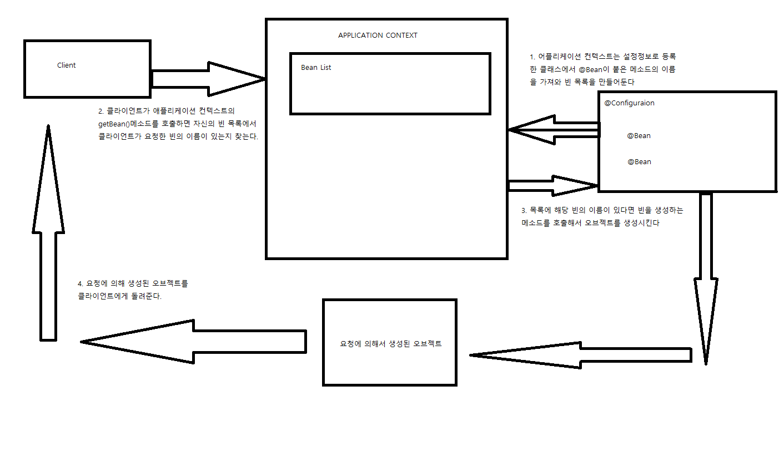
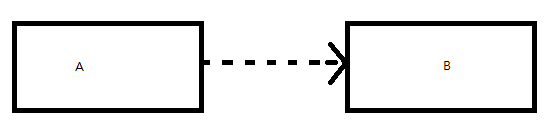
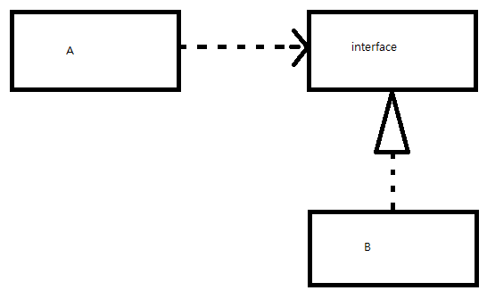

### 스프링
- 스프링 프레임 워크란
    * IoC와 AOP를 지원하는 경량 컨테이너 프레임워크 
    - POJO 기반의 Enterprise Application 개발을 쉽고 편하게 할 수 있도록 한다.
- Bean
    * Spring이 제어권을 가지고 직접 만들고 관계를 부여하는 오브젝트
    * Spring Bean은 Spring 컨테이너가 생성과 관계설정, 사용등을 제어해주는 IoC가 적용된 Object를 뜻한다.
- IoC란?
    * Inversion of Control(제어의 역전) - 객체 생성을 개발자가 하는것이 아닌 컨테이너가 대신 처리해준다.
    * 제어의 역전이란 프로그램의 제어 흐름 구조가 뒤바뀌는것이다.
        * 기존 프로그램의 흐름은 프로그램이 시작되는 지점에서 다음에 사용할 오브젝트를 결정
        * 결정된 오브젝트를 생성, 만들어진 오브젝트에 있는 메소드 호출
        * 해당 오브젝트 메소드 안에서 다음에 사용할 오브젝트를 경정, 호출......
    * 각 오브젝트는 프로그램 흐름을 결정하거나 사용할 오브젝트를 구성하는 작업에 능동적으로 참여
    
    * IoC는 이런 개념을 거꾸로 뒤집는다.
        * 오브젝트가 자신이 사용할 오브젝트를 스스로 정하지도 않고 생성하지도 않는다.
        * 심지어 자신이 어디서 어떻게 만들어지고 사용되는지도 모른다.
        * 프로그램의 엔트리 포인트를 제외한 모든 오브젝트는 모든 제어 권한을 다른 특별한 Object에게 위임한다.  
        
    * 서블릿, 프레임워크가 IoC의 대표적인 예

- 에플리케이션 컨텍스트
    - 스프링에서 빈의 생성과 관계설정 같은 제어를 담당하는 IoC 오브젝트인 Bean Factory를 좀 더 확장한 일종의 Bean Factory.
    - 애플리케이션 전반에 걸쳐 모든 구성요소의 제어 작업을 담당
    - 별도의 정보를 참고해서 Bean의 생성, 관계설정 등의 제어 작업을 총괄
        - 애플리케이션 컨텍스트가 어떤 오브젝트를 생성하고 어디에 연결할 것인가 등에 관한 정보를 담고 있지 않다.
        - 대신 설정정보를 담고 있는 무엇인가를 가져와 이를 활용하는 범용적인 IoC엔진 같은것
            - 설정정보에 해당하는 클래스에 @Configuration이라는 어노테이션을 사용해 Bean Factory를 위한 오브젝트 설정을 담당하는 클래스라고 알린다.
                - 즉 애플리케이션 컨텍스트 혹은 Bean Factory가 사용할 설정정보라는 표시이다.
            - 설정정보 내부에 타입 오브젝트를 생성하고 초기화해 돌려주는 메서드에는 @Bean 어노테이션을 사용해 오브젝트 생성을 담당하는 IoC용 메서드라는 표시를 한다.
    - 애플리케이션 컨텍스트는 ApplicationContext타입의 오브젝트
    - @Configuration이 붙은 자바 코드를 설정정보로 사용하려면 AnnotationConfigApplicationContext를 이용한다.
```
public class UserDaoTest
    public static void main(String[] args) throws ClassNotFoundException,
            SQLException {
        ApplicationContext context = 
            new AnnotaionConfigApplicationContext(DaoFactory.class);
        UserDao ud = context.getBean("userDao", UserDao.class);
    }
}
```
- 
    - getBean() 메서드는 ApplicationContext가 관리하는 오브젝트를 요청하는 메서드.
        - getBean()의 파라미터는 ApplicationContext에 등록된 빈의 이름
        - @Bean 어노테이션을 사용한 메서드의 이름이 빈의 이름이 된다.
            - 즉 userDao라는 이름의 빈을 가져온다는 것은 DaoFactory의 userDao()메서드를 호출해서 그 결과를 가져온다고 생각하면 된다.
        - 메서드의 이름을 빈의 이름으로 하는 이유는 빈 오브젝트르 생성하는 방식이나 구성을 다르게 가져가는 메서드를 추가할 수 있기 때문이다.
        - getBean()메서드는 기본적으로 Object타입을 반환하기에 매번 캐스팅을 해줘야 하지만 Java 5 이상부터 지원하는 제네릭 메소드 방식을 사용해 getBean의 두번째 파라미터로 리턴 타입을 지정해주면 캐스팅을 사용하지 않아도 된다.
        
- 애플리케이션 컨텍스트의 작동방식
  - 애플리케이션 컨텍스트는 애플리케이션에서 IoC를 적용해서 관리할 모든 오브젝트에 대한 생성과 관계설정을 담당한다.
    - 직접 오브젝트를 생성하고 관계를 맞어주는 코드가 없지만 별도의 설정정보를 통해 생성정보와 연관관계 정보를 얻는다.
  - 
  - 애플리케이션 컨텍스트를 사용하면 범용적이고 유연한 방법으로 IoC기능을 확장할 수 있다.
    - 장점1: 클라이언트는 구체적인 팩토리 클래스를 알 필요없이 일관된 방식으로 원하는 오브젝트를 가져올 수 있다.
    - 장점2: 오브젝트가 만들어지는 방식, 시점과 전략을 다르게 가져갈 수 있고, 이에 부가적으로 자동생성, 오브젝트에 대한 후처리, 정보의 조합 ,설정 방식의 다변화, 인터셉팅 등 오브젝트를 효과적으로 활용할 수 있는 기능을 제공한다.
    - 장점3: 애플리케이션 컨텍스트의 getBean() 메소드는 빈의 이름을 이용해 빈을 찾아준다. 
      - 타입만으로 빈을 검색하거나 특별한 어노테이션 설정이 되어 있는 빈을 찾을 수도 있다.
      
- 빈, 빈 팩토리, 애플리케이션 컨텍스트, 설정정보, IoC컨테이너, 스프링 프레임워크를 설명할 수 있어야 한다.

- 싱글톤 레지스트리와 오브젝트 스코프
  - 스프링은 여러 번에 걸쳐 빈을 요청하더라도 매번 동일한 오브젝트를 돌려준다.
  - 그 이유는 애플리케이션 컨텍스트는 싱글톤을 저장하고 관리하는 싱글톤 레지스트리이기때문이다.
  - 스프링은 별다른 설정을 하지 않으면 내부에서 생성하는 빈 오브젝트를 모두 싱글톤으로 만든다.
  - 여기서 말하는 싱글톤은 디자인 패턴에서의 싱글톤 패턴과는 비슷한 개념이지만 구현 방법이 다르다.
  - 빈을 싱글톤으로 만드는 이유는 요청이 올때마다 로직을 담당하는 오브젝트를 새로 만들면 서버가 감당하기 어려워지기 때문이다.
- 스프링은 자바의 기본적인 싱글톤 패턴의 단점때문에 직접 싱글톤 형태의 오브젝트를 만들고 관리하는 기능을 제공한다.
  - 싱글톤 레지스트리
    - 평번한 자바 클래스를 싱글톤으로 활용하게 해준다.
      - 오브젝트 생성에 관한 모든 권한은 애플리케이션 컨텍스트가 가지고 있기 때문
    - 멀티스레드 환경이라면 여러 스레드가 동시에 접근해서 싱글톤 오브젝트를 사용할수 있기에 상태 관리에 주의해야 한다.
      - 기본적으로 싱글톤이 멀티스레드 환경에서 서비스 형태의 오브젝트로 사용되는 경우에는 상태정보를 내부에 갖고 있지 않은 stateless방식으로 만들어져야 한다.
      - 여러 사용자의 요청을 처리하는 스레드들이 동시에 싱글톤 오브젝트의 인스턴스 변수를 수정하는건 매우 위험하다.
        - 저장할 공간이 하나라서 서로 값을 덮어쓰거나 저장하지 않은 값을 불러올 수 있기 때문.
      - stateless 방식으로 클래스를 만든 경우 각 요청에 대한 정보나 DB나 서버의 리소스로부터 생성한 정보는 어떻게 다루면 될까?
        - 파라미터와 로컬 변수, 리턴 값등을 사용한다.
        - 메소드 파라미터나 메소드 안에서 생성되는 로컬 변수는 매번 새로운 값을 저장할 독집적인 공간이 만들어지기 때문에 여러 스레드가 변수의 값을 덮어쓸 일은 없다.
    
    - 스프링 빈 스코프
      - 스프링이 관리하는 오브젝트인 빈이 생성되고 존재하고 적용되는 범위를 스코프라고 한다.
      - 스프링의 기본 스코프는 싱글톤
      - 컨테이너에 빈을 요청할 때마다 매번 새로운 빈 오브젝트를 생성하는 Prototype 스코프
      - 웹을 통해 새로운 HTTP 요청이 생길 때마다 생성되는 Request 스코프
      - 웹의 세션과 비슷한 Session 스코프
      
- Dependency Injection 의존관계 주입
  - 스프링이 제공하는 IoC의 방식의 핵심을 짚어주는 이름이다.
  - DI는 오브젝트의 레퍼런스를 전달한다.
    - 외부로부터 오브젝트 레퍼런스를 제공 받고 이를 통해 여타 오브젝트와 다이나믹하게 의족관계가 만들어지는 것
- 의존관계
  - UML에선 클래스의 의존 관계를 점선 화살표로 표현한다.
  - A가 B에 의존하고 있음을 표현하는 UML
 
  - 의존하고 있다는 것은 의존대상, 위의 그림에서는 B가 변하면 그 변화가 A에 영향을 미친다는 것이다.
  - 의존성에는 방향성이 있다.

  - 위 그림에서 A는 interface에만 의존하고 있다.
    - 따라서 interface가 바뀐다면 그 영향을 직접적으로 받는다.
    - 하지만 interface를 구현하는 클래스, B가 다른 것으로 바뀌거나 내부에서 사용하는 메소드에 변화가 생겨도 A는 영향이 없다.
      - 인터페이스에 대해서만 의존관계를 만들었기 때문에 인터페이스 구현 클래스와의 관계가 느슨해지고 결합도가 낮아진다.
  - 프로그램이 시작되고 A 오브젝트가 만들어지고 나서 런타임 시에 의존관계를 맺는 대상, 실제 사용대상인 오브젝트를 **의존 오브젝트**라고 한다.
  - 의존 관계 주입이란 이렇게 구체적인 의족 오브젝트와 그것을 사용할 주체, 혹은 클라이언트라 부트는 오브젝트를 런타임 시에 연결해주는 작업이다.
    - A클래스는 인터페이스가 요구하는 조건을 만족한 어떤 클래스든 받아들이고 사용할 수 있다.
  1. 클래스 모델이나 코드에는 런타임 시점의 의존관계가 드러나지 않는다. 인터페이스에만 의존하고 있어야 한다.
  2. 런타임 시점의 의존관계는 **컨테이너나 팩토리 같은 제3자(어플리케이션 컨택스트, 빈 팩토리, IoC컨테이너)가 결정**한다.
  3. 의존관계는 사용할 오브젝트에 대한 레퍼런스를 외부에서 주입(제공)해줌으로써 만들어진다.
- 주입이라는 것은 외부에서 내부로 무엇인가 넘겨줘야 하는 것.
- 자바에서 오브젝트에 무엇인가를 넘겨준다는 개념은 메소드를 실행하면서 파라미터로 오브젝트의 **레퍼런스**를 전달해주는 방법뿐이다.
- 가장 쉽게 사용할 수 있는 파라미터 전달이 가능한 메소드는 생성자이다.


- DI컨테이너는 자신이 결정한 의존관례를 맺어줄 클래스의 오브젝트를 만들고 이 생성자의 파라미터로 오브젝트의 레퍼런스를 전달해준다.
  - 생성자 파라미터를 통해 전달받은 런타임 의존관계를 갖는 오브젝트는 인스턴스 변수에 저장해둔다.
```
public class UserDao {
    private ConnectionMaker connectionMaker;

    public UserDao(ConnectionMaker connectoinMaker) {
        this.connectionMaker = connectionMaker;
    }
    ...
}
```

- 위와 같이 의존관계가 만들어지면 UserDao오브젝트는 이제 생성자를 통해 주입받은 오브젝트를 언제든지 사용하면 된다.
- DI는 자신이 사용할 오브젝트에 대한 선택과 생성 제어권을 외부로 넘기고 자신은 수동적으로 주입받은 오브젝트를 사용한다.


##### 의존관계 검색(dependency lookup)
- 자신이 필요로 하는 의존 오브젝트를 능동적으로 찾는다.
  - 런타임 시 의존관계를 맺을 오브젝트를 결정하는 것과 오브젝트의 생성은 외부 컨테이너에게  IoC로 맡기지만 이를 가져올 때는 메소드나 생성자를 통한 주인 대신 스스로 컨테이너에게 요청한다.
```
//DaoFactory를 사용하는 생성자
public UserDao() {
    DaoFactory daoFactory = new DaoFactory();
    this.connectionMaker = daoFactory.connectionMaker();
}
```
- 위와 같이 코드를 작성해도 UserDao는 여전히 자신이 어떤 ConnectionMaker 오브젝트를 사용할지 미리 알지 못하며 ConnectionMaker 인터페이스에만 의존한다.
- 스프링의 IoC컨테이너인 애플리케이션 컨텍스트는 getBean()이라는 메소드를 제공한다.
  - 의존관계 검색에 사용되는 메소드
```
public UserDao(){
    AnnotationConfigApplicationContext context = new AnnotationConfigApplicationContext(DaoFactory.class);
    this.connectionMaker = context.getBean("connectionMaker", ConnectionMaker.class);
}
```


    
- AOP란?
    * Aspect Oriented Programming - 관점 지향 프로그래밍
- Dependency Injection
    * 의존성 주입 - IoC의 형태 중 하나. 클래스 사이에 필요로 하는 의존관계를 컨테이너가 자동으로 처리해주는 것
    
- 스프링 vs 스프링 MVC vs 스프링 부트
    * 스프링은 "IoC와 DI를 지원하는 하나의 거대한 프레임 워크"이며 여러 컴포넌트들을 가진다.
    * 그 컴포넌트중 하나가 바로 스프링 MVC
        * 스프링 MVC는 "Model View Controller 디자인 패턴"을 통해 웹 응용 프로그램을 디자인 할 때 사용
        * MVC?
            - 
    * 스프링 부트는 Spring 개발을 보다 빠르고 광범위하게 접근 가능하게 만드는 스프링 프레임 워크의 확장도구 같은 것.
        * 스프링 부트의 핵심은 pom.xml(Maven) 혹은 build.gradle(Gradle) 파일 내용에 따라 클래스 패스, 어노테이션, 기타 자바구성클래스를 보고 자동구성하는것
        * 스프링을 쉽게 사용할 수 있도록 필요한 설정을 대부분 미리 세팅 해놓았다는 뜻
        
- What Spring Boot property is used to set the logging level for the entire application in the application.properties file?
    - logging.level.root
- What dependencies does spring-boot-starter-test NOT bring to the classpath?
    - Spring MVC
    - https://mvnrepository.com/artifact/org.springframework.boot/spring-boot-starter-test/2.2.6.RELEASE
- 생성자 주입과 Setter 주입의 차이점
    - http://javainsimpleway.com/setter-dependency-injectionsdi-vs-constructor-dependency-injectioncdi/
    - 생성자 주입과 Setter 주입을 모두 사용하면 스프링 컨테이너는 setter 주입을 우선적으로 사용한다.
    - Partial Dependency 
        * 생성자 주입 방식으로는 Partial Dependency를 구현할 수 없다.
            - 생성자 주입 방식으로는 생성자에 있는 모든 arguments들을 넘겨주어야 하기 때문.
            - 하지만 Setter 방식은 필요한 혹은 원하는 의존성들만 주입하는것이 가능하다.
```
//아래와 같은 코드가 있다고 가정해보자
public class Person {
    private int id;
    private String name;
    private String[] hobbies;
}

public Person(int id, String name, String[] hobbies) {
        this.id = id;
        this.name = name;
        this.hobbies = hobbies;
}
```
```
//생성자 주입을 사용한다면 다음과 같이 주입을 해야 한다.
<bean id="person" class="com.kb.di.Person">
    <constructor-arg value="1" type="int"/>
    <constructor-arg value="Raj"/>
    <constructor-arg>
    <array>
    <value>Playing cricket</value>
    <value>Coding</value>
    <value>Reading books</value>
    </array>
</constructor-arg>
</bean>
```    
```
//만약 아래와 같이 하나라도 빠진다면(지금 같은 경우는 name이 빠진 상태) 에러가 발생한다.
<bean id="person" class="com.kb.di.Person">
    <constructor-arg value="1" type="int"/>
    <constructor-arg>
    <array>
    <value>Playing cricket</value>
    <value>Coding</value>
    <value>Reading books</value>
    </array>
</constructor-arg>
</bean>
```

```
//하지만 setter메소드를 사용한다면
public void setId(int id) {
        this.id = id;
    }
 
    public void setName(String name) {
        this.name = name;
    }
 
    public void setHobbies(String[] hobbies) {
        this.hobbies = hobbies;
    }
```
```
//이와 같이 부분적으로 주입이 가능하다.
<bean id="person" class="com.kb.di.Person">
        <property name="id" value="1"></property>
        <property name="name" value="Raj"></property>
       
</bean>
```
```
//물론 생성자 주입과 마찬가지로 전체를 주입할 수도 있다.
<bean id="person" class="com.kb.di.Person">
        <property name="id" value="1"></property>
        <property name="name" value="Raj"></property>
        <property name="hobbies">
            <array>
                <value>Playing cricket</value>
                <value>Coding</value>
                <value>Reading books</value>
            </array>
 
        </property>
</bean>
```

#### Controller and RestController

###쉐어 잇 인터뷰 질문
#### 스프링 어노테이션
- @Repository
    - 데이터 엑세스 계층의 DAO 또는 리포지토리 클래스에 사용한다.
    - DataAccessException 자동변환과 같은 AOP의 적용 대상을 선정하기 위해서도 사용된다.
    - @Component를 메타 애노테이션으로 가지고 있다.
- @Service
    - 서비스 계층의 클래스에 사용된다.
    - @Component를 메타 애노테이션으로 가지고 있다.
- Controller
    - 프레젠테이션 계층의 MVC컨트롤러에 사용된다. 스프링 웹 서블릿에 의해 웹 요청을 처리하는 컨트롤러 빈으로 선정된다.
    - @Component를 메타 애노테이션으로 가지고 있다.
    

#### Model View Controller 각 역할
- 프레젠테이션 계층의 구성요소 정보(data)를 담은 Model (Object 혹은 자바 POJO). 
- 모델과 뷰의 사이에서 데이터의 흐름을 제어하고 비지니스 로직을 담고있는 Controller. 유저 요청을 처리하고 적절한 Model을 생성하여 View에 전달한다.
- 모델이 가지고 있는 데이터의 화면 출력 로직을 담고있는 View.
#### 스프링 빈/ 빈 스코프
#### Jpa/ N+1문제
#### 디스패처 서블릿
- 서블릿 중 하나이며 들어온 요청을 Dispatch하는 역할을 하기 때문에 "Dispatcher Servlet" 이라는 이름이 붙었다.
- Servlet Container에서 HTTP프로토콜을 통해 들어오는 모든 요청을 프레젠테이션 계층의 제일앞에 둬서 중앙집중식으로 처리해주는 서블릿 (프론트 컨트롤러(Front Controller))
    - 들어오는 HttpRequests들을 적절한 Handler와 Controller로 안내하는 역할
- 
    1. DispatcherServlet이 요청을 받는다.
    2. DispatcherServlet이 HandlerMapping에게 적절한 Controller를 선택하는 작업을 수행시킨다. HandlerMapping은 요청URL에 매핑되어있는 Controller를 선택하고 (selected Handler)와 Controller를 DispatcherServlet에 반환한다.
    3. DispatcherServlet이 HandlerAdapter에게 반환된 Controller에 있는 비지니스 로직을 실행하도록 한다.
    4. HandlerAdapter가 Controller에 있는 비지니스 로직 프로세스를 호출한다.
    5. Controller가 요청된 비지니스 로직을 수행하고 그 결과를 Model에 담은 뒤 view이름과 함께 HandlerAdapter에 반환한다.
    6. DispatcherServlet은 반환된 view이름에 맞는 View를 찾는 작업을 ViewResolver에 보내고 ViewResolver는 그에 해당하는 View를 반환한다.
    7. DispatcherServlet은 반환된 View에게 렌더링 프로세스를 실행하도록 한다.
    8. View는 Model 데이터를 렌더링하고 응답을 반환한다.
    - [출처](https://terasolunaorg.github.io/guideline/1.0.1.RELEASE/en/Overview/SpringMVCOverview.html)
    
- 