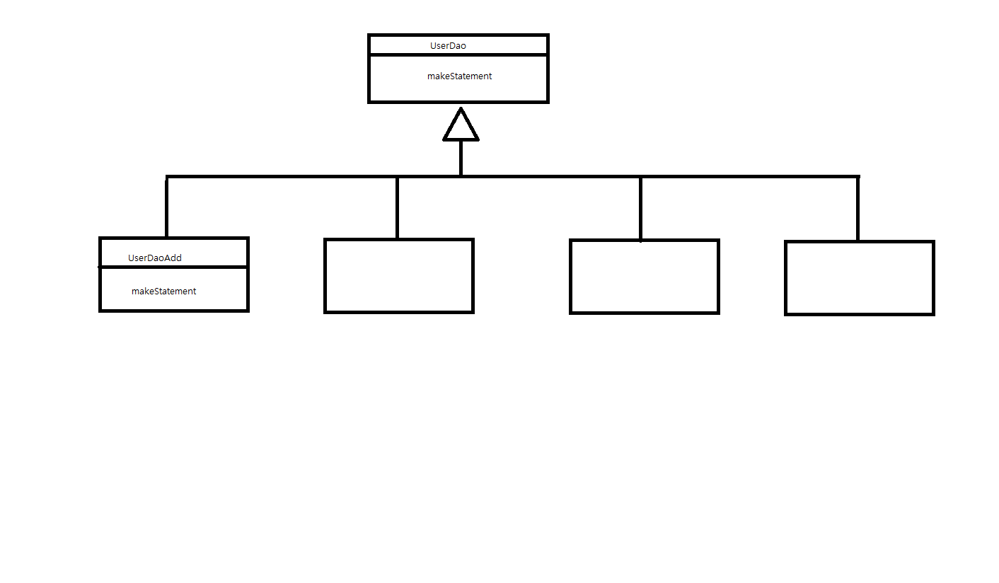
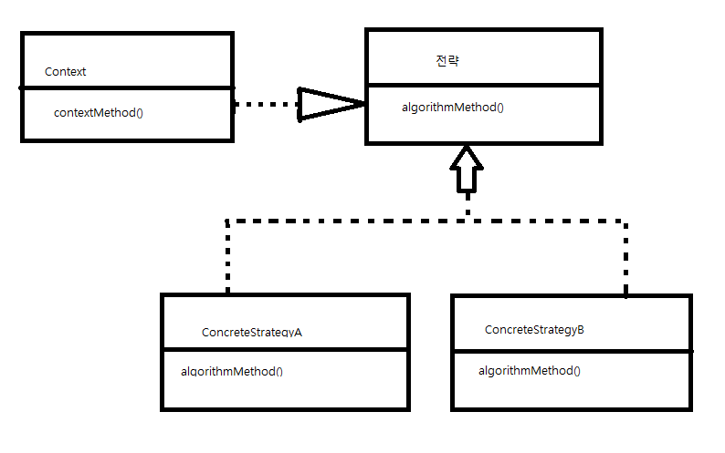
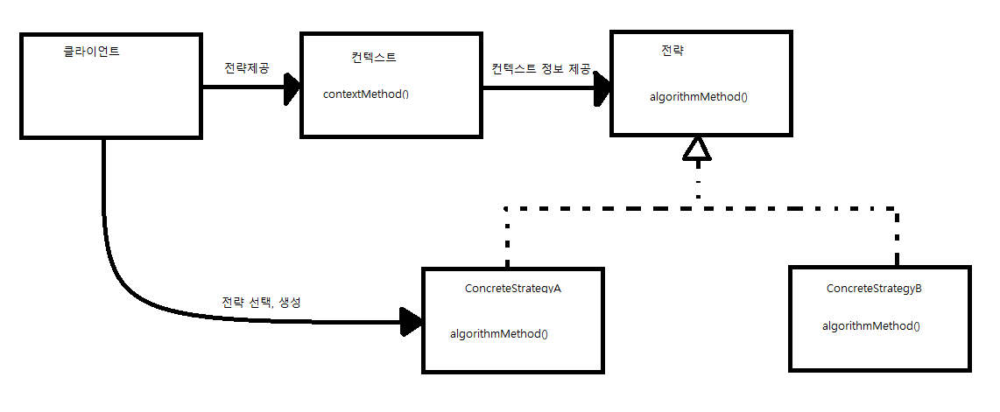
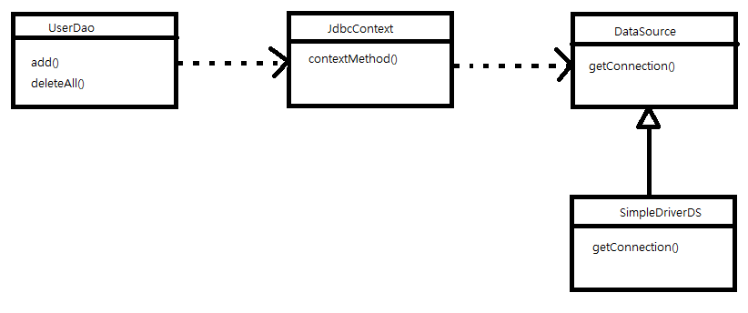
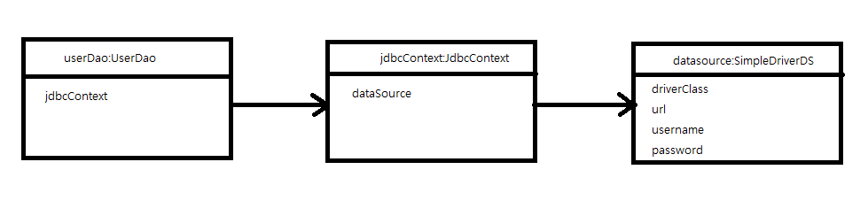
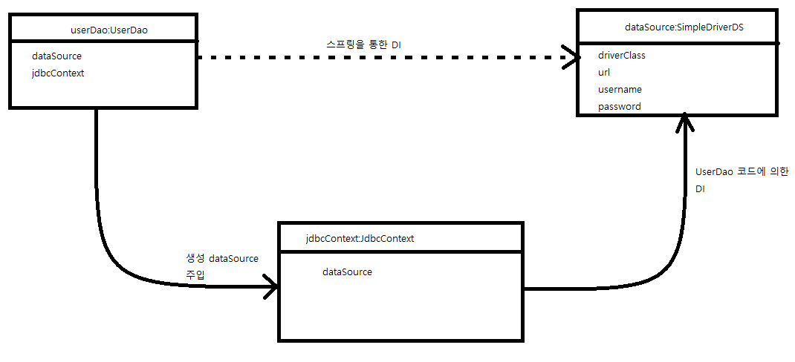

#### 토비의 스프링 3장

##### 3.1.1 예외처리 기능을 갖춘 DAO
- 정상적인 JDBC 코드의 흐름을 따르지 않고 중간에 예외가 발생한 경우 사용한 리소스를 반드시 반환해야 한다.
- 아래는 UserDao의 가장 단순한 메소드인 deleteAll() 메소드이다.
```
public void deleteAll() throws SQLException {
    Connection c = dataSource.getConnection();
    
    //아래 두 코드에서 예외가 발생하면 바로 메소드 실행이 중단된다.
    PreparedStatement ps = c.prepareStatement("delete from users");
    ps.excuteUpdate();

    ps.close();
    c.close();
```

- 위에서 두 코드에서 예외가 발생하면 close()메소드가 실행되지 않아 리소스가 반환되지 않을 수 있다.
  - 서버는 제한된 수의 DB커넥션을 만들어 재사용 가능한 풀로 관리한다.
  - DB풀은 매번 getConnection()으로 가져간 커넥션을 명시적으로 close() 해서 돌려줘야 재사용이 가능해진다.
  - 하지만 에러 때문에 제대로 반환이 이루어지지 않으면 풀에 여유가 없어지고 리로스 부족 오류를 내며 서버가 중단될 수 있다.

```
public void deleteAll() throws SQLException {
    Connection c = null;
    PreparedStatement ps = null;
    
    try { // 예외가 발생할 가능성이 있는 코드를 try로 묶는다
        c = dataSource.getConnection();
        ps = c.prepareStatement("delete from users");
        ps.executeUpdate();
    }catch (SQLException e) { //예외가 발생한 경우 부가적인 작업을 해주도록 catch블록을 둔다.
        throw e;
    } finally { //예외가 발생했을때나 안 했을떄 모두 실행되는 finally
        if (ps != null) {
            try {
                ps.close(); // close에서도 예외가 발생할 수 있기 때문에 try-catch로 잡아준다.
            } catch (SQLException e) {
            }
        }
        if (c!= null) {
            try {
                c.close();
            } catch (SQLException e) {
            }
        }
    }
}
```

- 조회를 위한 JDBC코드는 좀 더 복잡하다.
```
public void deleteAll() throws SQLException {
    Connection c = null;
    PreparedStatement ps = null;
    ResultSet rs = null;
    
    try { // 예외가 발생할 가능성이 있는 코드를 try로 묶는다
        c = dataSource.getConnection();
        ps = c.prepareStatement("select count(*) from users");
        rs = ps.executeQuery();
        rs.next();
        return rs.getInt(1);
    }catch (SQLException e) { //예외가 발생한 경우 부가적인 작업을 해주도록 catch블록을 둔다.
        throw e;
    } finally { //예외가 발생했을때나 안 했을떄 모두 실행되는 finally
        if (rs != null) {
            try {
                rs.close(); // close에서도 예외가 발생할 수 있기 때문에 try-catch로 잡아준다.
            } catch (SQLException e) {
            }
        }
        if (ps != null) {
            try {
                ps.close(); // close에서도 예외가 발생할 수 있기 때문에 try-catch로 잡아준다.
            } catch (SQLException e) {
            }
        }
        if (c!= null) {
            try {
                c.close();
            } catch (SQLException e) {
            }
        }
    }
}
```

##### 3.2.1 JDBC try/catch/finally 코드의 문제점
- try/catch/finally가 모든 메소드마다 반복되며 코드가 복잡해졌다.
- 이 문제의 핵심은 변하지 않는, 그러나 많은 곳에서 중복되는 코드와 로직에 따라 자꾸 확장되고 자주 변하는 코드를 분리하는 작업이다.

```
public void deleteAll() throws SQLException {
    Connection c = null;
    PreparedStatement ps = null;
    
    try { 
        c = dataSource.getConnection();
        ps = c.prepareStatement("delete from users"); // 변하는 부분
        ps.executeUpdate();
    }catch (SQLException e) { 
        throw e;
    } finally { 
        if (ps != null) {
            try {
                ps.close(); 
            } catch (SQLException e) {
            }
        }
        if (c!= null) {
            try {
                c.close();
            } catch (SQLException e) {
            }
        }
    }
}
```

- 변하는 부분을 변하지 않는 나머지 코드에서 분리하는 방법
- 메소드 추출
```
private PreparedStatement makeStatement(Connection c) throws SQLException {
    PreparedStatement ps;
    ps = c.prepareStatement("delete from users");
    return ps;
}

public void deleteAll() throws SQLException {
    Connection c = null;
    PreparedStatement ps = null;
    
    try { 
        c = dataSource.getConnection();
        ps = makeStatement(c); -> 변하는 부분만 메소드로 추출
        ps.executeUpdate();
    }catch (SQLException e) { 
        throw e;
    } finally { 
        if (ps != null) {
            try {
                ps.close(); 
            } catch (SQLException e) {
            }
        }
        if (c!= null) {
            try {
                c.close();
            } catch (SQLException e) {
            }
        }
    }
}
```
- 보통 메소드 추출 리팩토링을 적용하는 경우, 분리시킨 메소드를다론 곳에서 재사용할 수 있어야 하는데 위의 코드는 반대로 분리시키고 남은 메소드가 재사용이 필요한 부분이고, 분리된 메소드는 DAO 로직마다 새롭게 만들어서 확장해야 한다.
  - 뭔가 반대로 됐다.

- 템플릿 메소드 패턴 적용
- 상속을 통해 기능을 확장해서 사용하는 부분이다.
  - 변하지 않는 부분은 슈퍼클래스에 두고 변하는 부분은 추상 메소드로 정의해서 서브클래스에서 오버라이드하여 새롭게 정의해 쓰도록 한다.
- 추천해서 별도의 메소드로 독립시킨 makeStatement()메소드를 다음과 같이 추상 메소드 선언으로 변경하고 UserDao역시 추상 클래스로 만든다.
  
```
abstract protected PreparedStatement makeStatement(Connection c) throws SQLException;
```

- 그리고 위의 추상 클래스를 상속하는 서브클래스를 만들어 메소드를 구현한다.

```
public class UserDaoDeleteAll extends UserDao {
    protected PreparedStatement makeStatement(Connection c) throws SQLException {
        PreparedStatement ps = c.prepareStatement("delete from users");
        return ps;
    }
}
```

- DAO 로직마다 상속을 통해 새로운 클래스를 만들어야 한다는 점이 큰 단점이다.
- 그림과 같이 UserDao의 JDBC 메소드가 4개라면 그에 맞춰 4개의 서브클래스를 만들어서 사용해야 한다.
- 또한 확장구조가 이미 클래스를 설계하는 시점에서 고정되어 버린다.
  - 변하지 않는 코드를 가진 UserDao의 JDBC try/catch/finally 블록과 변하는 PreparedStatement를 담고 있는 서브클래스들이 이미 클래스 레벨에서 컴파일 시점에 이미 그 관계가 결정되어 있다.
  - 관계에 대한 유연성이 떨어진다.
- 상속을 통애 확장을 하는 템플릿 메소드의 단점이 고스란히 드러난다.

- 전략 패턴의 적용
- 오브젝트를 아예 둘로 분리하고 클래스 레벨에서는 인터페이스를 통해서만 의존하도록 만드는 전략 패턴.
  - 확장에 해당하는 부분인 변하는 부분을 별도의 클래스로 만들어 추상화된 인터페이스를 통해 위임하는 방식.

- deleteAll() 메소드에서 변하지 않는 부분이라고 명시한 것이 contextMethod()가 된다.
- 컨텍스트란 변하지 않는 맥락이다
  - deleteAll()의 컨텍스트
  1. DB커넥션 가져오기
  2. PreparedStatement를 만들어줄 외부 기능 호출
  3. 전달받은 PreparedStatement 실행
  4. 예외 발생시 이를 다시 메소드 밖으로 던지기
  5. 모든 경우에 만들어진 PreparedStatement와 Connection을 적절히 닫기
- PreparedStatement를 만들어주는 외부 기능이 바로 전략 패턴에서의 전략에 해당한다.
- 전략 패턴의 구조를 따라 이 기능을 인터페이스로 만들어두고 인터페이스의 메소드를 통해 PreparedStatement 생성 전략을 호출해주면 된다.
- PreparedStatement를 생성하는 전략 호출시, 해당 컨텍스트 내에서 만들어둔 DB커넥션을 전달해야 한다.
```
package springbook.user.dao;
...
public interface StatementStrategy {
    PreparedStatement makePreparedStatement(Connection c) throws SQLExceptoin ;
}
```
- 위의 인터페이스를 상속해 PreparedStatement를 생성하는 클래스를 생성

```
package springbook.user.dao;
...
public class DeleteAllStatement implements StatementStrategy {
    public PreparedStatement makePreparedStatement(Connection c) throws SQLException {
        PreparedStatement ps = c.prepareStatement("delete from users");
        return ps;
    }
}
```
- 확장된 PreparedStrategy 전략인 DeleteAllStatement를 다음과 같이 contextMethod()에 해당하는 UserDao의 deleteAll() 메소드에서 사용하면 그럭저럭 전략 패턴을 사용했다 할 수 있다.
```
public void deleteAll() throws SQLException{
    ...
    try{
        c = dataSource.getConnection();
        
        StatementStrategy s = new DeleteAllStatement();
        ps = s.makePreparedStatement(c);

        ps.executeUpdate();
    } catch (SQLException e) {
    ...
    
}
```
- 다만 이렇게 컨텍스트 안에서 이미 구체적인 전략 클래스인 DeleteAllStatement를 사용하도록 고정되어 있다면 뭔가 이상하다. 
- 컨텍스트가 StatementStrategy 인터페이스뿐 아니라 특정 구현 클래스인 DeleteAllStatement를 직접 알고 있다는건 전략 패턴에도, OCP에도 잘 맞는다 보기 어렵다.

- DI 적용을 위한 클라이언트/컨텍스트 분리
- 전략패턴에 따르면 Context가 어떤 전략을 사용하게 할 것인가는 Context를 사용하는 앞단의 Client가 결정하는 게 일반적이다.
  - Client가 구체적인 전략 하나를 선택하고 오브젝트로 만들어 Context에 전달한다.
  - Context는 전달받은 해당 전력 구현 클래스의 오브젝트를 사용한다.

- DI란 이런 전략 패턴의 장점을 일반적으로 활용할 수 있도록 만든 구조
  - UserDao(컨텍스트)가 필요로 하는 ConnectionMaker(전략)의 특정 구현 클래스(DConnectionMaker) 오브젝트를 UserDaoTest(클라이언트)가 만들어서 제공해주는 방법을 사용
- 결국 위 그림과 같은 구조에서 전략 오브젝트 생성과 컨텍스트의 전달을 담당하는 책임을 분리 시킨 것이 바로 ObjectFactory이며, 이를 일반화한 것이 의존관계 주입(Dependency Injection)이다.

- 현재 deleteAll()메소드에서 StatementStrategy s = new DeleteAllStatement(); 이 코드는 클라이언트에 들어가야 할 코드이다.
  - 나머지 코드들은 컨텍스트 코드이므로 분리 필요
- 컨텍스트에 해당하는 부분은 별도의 메소드로 독립
- 클라이언트는 DeleteAllStatement 오브젝트 같은 전략 클래스의 오브젝트를 컨텍스트 메소드로 전달
- 이를 위해 전략 인터페이스인 StatementStrategy를 컨텍스트 메소드 파라미터로 지정
```
public void jdbcContextWithStatementStrategy(StatementStrategy stmt) throws SQLException { //stmt는 클라이언트가 컨텍스트를 호출할 때 넘겨줄 전략 파라미터이다.
    Connection c = null;
    PreparedStatement ps = null;

    try {
        c = dataSource.getConnection();

        ps = stmt.makePreparedStatement(c);

        ps.executeUpdate();
    } catch (SQLException e) {
        throw e;
    } finally {
        if(ps != null) {try {ps.close(); } catch (SQLException e) {} }
        if(c != null) {try {c.close(); } catch (SQLException e) {} }
    }
}
```
- 위의 코드는 컨텍스트의 핵심적 내용을 잘 담고있다.
- 클라이언트로부터 StatementStrategy 타입의 전략 오브젝트를 제공받고 컨텍스트 내에서 작업을 수행한다.
- 제공받은 전략 오브젝트는 PreparedStatement 생성이 필요한 시점에 호출해서 사용한다.

- 다음은 클라이언트에 해당하는 부분
- 컨텍스트를 별도의 메소드로 분리했으니 deleteAll() 메소드가 클라이언트가 된다.
  - 즉 전략 오브젝트를 만들고 컨텍스트를 호출하는 책임을 가진다.
```
public void deleteAll() throws SQLException {
    StatementStrategy st = new DeleteAllStatement(); // 선정한 전략 클래스와 오브젝트 생성
    jdbcContextWithStatementStrategy(st); // 컨텍스트 호출, 전략 오브젝트 전달
}
```
- 비록 클라이언트와 컨텍스트는 클래스를 분리하진 않았지만 의존관계와 책임으로 볼 때 좋은 전략 패턴의 모습을 갖췄다.

##### 3.3 JDBC 전략 패턴 최적화
- 이제 독립된 JDBC 작업 흐름이 담긴 jdbcContextWithStatementStrategy()는 DAO 메소드들이 공유할 수 있게 됐다.
- DAO 메소드는 전략 패턴의 클라이언트로서 컨텍스트에 해당하는 jdbcContextWithStatementStrategy() 메소드에 전략(바뀌는 로직)을 제공해주는 방법으로 사용할 수 있다.
  - 컨텍스트 = PreparedStatement를 실행하는 JDBC의 작업 흐름
  - 전략 = PreparedStatement를 생성하는 것
  
##### 3.3.1 전략 클래스의 추가 정보
- add() 메소드에 적용하기
```
public Vlass AddStatement implements StatementStrategy {
    public PreparedStatement makePreparedStatement(Connection c) throws SQLException {
        PreparedStatement ps = c.prepareStatement("insert into user(id, name ,passwd) values (?,?,?)");
        ps.setString(1, user.getId());
        ps.setString(2, user.getName());
        ps.setString(3, user.getPasswd());
        
        return ps;
    }
}
```
- all()에서는 PreparedStatement를 만들 때 user라는 부가적인 정보가 필요하다.
- 사용자 정보는 클라이언트에 해당하는 add()메소드가 가지고 있다.
  - 클라이언트가 AddStatement의 전략을 수행하려면 부가정보인 user를 제공해줘야 한다.
```
package springbook.user.dao;
...
public Vlass AddStatement implements StatementStrategy {
    User user;

    public class AddStatement(User user){
        this.user  = user;
    }
    
    public PreparedStatement makePreparedStatement(Connection c) {
        ...
        ps.setString(1, user.getId());
        ps.setString(2, user.getName());
        ps.setString(3, user.getPasswd());
        ...
    }
}
```
- 이제 컴파일 에러는 나지 않는다.
- 다음은 클라이언트인 UserDao의 add()메소드를 다음과 같이 user 정보를 생성자를 통해 전달해주도록 한다.
```
public void add(User user) throws SQLException {
    StatementStrategy st = new AddStatement(user);
    jdbcContextWithStatement(st);
}
```

- 두가지 개선점
  - DAO 메소드마다 새로운 StatementStrategy 구현 클래스를 만들어야 한다. -> 클래스 파일이 많아진다.
  - DAO 메소드에서 StatementStrategy에 전달할 User와 같은 부가적인 정보가 있는 경우, 이를 위해 오브젝트를 전달받는 생성자와 이를 저장해둘 인스턴스 변수를 번거롭게 만들어야 한다.
  
- 클래스 파일이 많아지는 문제는 클래스 안에 내부 클래스로 정의해버리는 것이다.
  - DeleteAllStatement, AddStatement는 UserDao안에서만 사용되고 UserDao의 메소드 로직에 강하게 결합되어 있다.
  
```
public void add(User user) throws SQLException {
    class AddStatement implements StatementStrategy {
        User user;
        
        public AddStatement(User user) {
            this.user = user;
        }
        
        public PreparedStatement makePreparedStatement(Connection c) throws SQLException{
            PreparedStatement ps = c.prepareStatement("insert into users(id, name, passwd) values(?,?,?,)");
            ps.setString(1, user.getId());
            ps.setString(2, user.getName());
            ps.setString(3, user.getPasswd());

            return ps;
        }
    }
    StatementStrategy st = new AddStatement(user);
    jdbcContextWithStatementStrategy(st);
}
```
-중첩 클래스의 종류
  - 독립적으로 오브젝트로 만들어질 수 있는 static class
  - 자신이 정의된 클래스의 오브젝트 안에서만 만들어질 수 있는 내부 클래스(inner class)
    - 내부 클래스는 범위에 따라 3가지로 구분
    1. 오브젝트 레벨에 정의되는 멤버 내부 클래스
    2. 메소드 레벨에 정의되는 로컬 클래스
    3. 이름을 갖지 않는 익명 내부 클래스. 이 클래스의 범위는 선언된 위치에 따라 다르다.
    
- 내부 클래스에서 외부의 변수를 사용할 때는 외부 변수는 반드시 final로 선언해야 한다.

```
public void add(final User user) throws SQLException {
    class AddStatement implements StatementStrategy {
        public PreparedStatement makePreparedStatement(Connection c) throws SQLException {
            PreparedStatement ps = c.prepareStatement("insert into users(id, name, passwd) values(?,?,?)");
            
            //로컬 클래스의 코드에서 외부의 메소드 로컬 변수에 직접 접근할 수 있다.
            ps.setString(1, user.getId());
            ps.setString(2, user.getName());
            ps.setString(3, user.getPasswd());

            return ps;

        }
    }

    StatemenrStrategy st = new AddStatement();
    jdbcContextWithStatementSTrategy(st);
}
```

- 익명 내부 클래스
  - 익명 내부 클래스는 선언과 동시에 오브젝트를 생성
  - 익명이기에 자신의 타입을 가질 수 없고 구현한 인터페이스 타입의 변수에만 저장할 수 있다.
  
```
StatementStrategy st = new StatementSTrategy() {
    public PreparedStatement makePreparedStatement(Connection c) throws SQLException {
       PreparedStatement ps = c.prepareStatement("insert into users(id, name, passwd) values(?,?,?)");
            
            ps.setString(1, user.getId());
            ps.setString(2, user.getName());
            ps.setString(3, user.getPasswd());
       
            return ps;
    }
}
```
- 만들어진 익명 내부 클래스의 오브젝트는 딱 한 번 사용할테니 굳이 변수에 담지말고 jdbcContextWithStatementStrategy() 메소드의 파라미터에서 바로 생성하는편이 좋다.

```
public void add(final User user) throws SQLException {
    jdbcCONtextWithStatementSTrategy(new StatementSTrategy() {
        public PreparedStatement makePreparedStatement(Connection c) throws SQLException {
            PreparedStatement ps = c.prepareStatement("insert into users(id, name, passwd) values(?,?,?)");
            
            //로컬 클래스의 코드에서 외부의 메소드 로컬 변수에 직접 접근할 수 있다.
            ps.setString(1, user.getId());
            ps.setString(2, user.getName());
            ps.setString(3, user.getPasswd());

            return ps;
        }
    });
}
```
```
public void deleteAll() throws SQLException {
    jdbcContextWithStatementStrategy(new StatementSTrategy() {
        public PreparedSTatement makePreparedStatement(Connection c) throws SQLException {
            return c.prepareStatement("delete from users");
        }
    });
}
```
##### 3.4 컨텍스트와 DI
#### 3.4.1 jdbcContext의 분리
- UserDao의 메소드가 클라이언트이고, 익명 내부 클래스로 만들어지는 것이 개별적인 전략이며, jdbcContextWirhStatementStrategy()메소드는 컨텍스트이다.
- 컨텍스트 메소드는 UserDao 내의 PreparedStatement를 실행하는 기능을 가진 메소드에서 공유할 수 있다.
- jdbcContextWithStatementStrategy()를 UserDao 클래스 밖으로 독립시켜 모든 DAO가 사용할 수 있도록 하자.


- 클래스 분리
- 분리해서 만들 클래스의 이름은 JdbcContext
- jdbcContext에 UserDao에 있던 컨텍스트 메소드를 workWithStatementStrategy()라는 이름으로 옮겨놓는다.
- 이렇게 하면 DataSource가 필요한 것은 UserDao가 아니라 JdbcCOntext가 돼버린다.
  - DB커넥션을 필요로 하는 코드가 JdbcContext안에 있기 때문
  - JdbcCOntext가 DataSource타입의 빈을 DI 받을 수 있게 해야 한다.
```
package springbook.user.dao;
...
public class JdbcContext{
    private DataSource datasource;

    public void setDataSource(DataSource dataSource) {
        this.datasource = dataSource;
    }

    public void workWithStatementStrategy(StatementStrategy stmt) throws SQLException {
        Connection c = null;
        PreparedStatement ps = null;
        
        try {
            c = this.datasource.getConnection();

            ps = stmt.makePreparedStatement(c);

            ps.executeUpdate();
        } catch (SQLException e) {
            throw e;
        } finally {
            if (ps != null ) { try { ps.close(); } catch (SQLException e) {} }
            if (c != null ) { try { c.close(); } catch (SQLException e) {} }
        }
    }
}

```
```
public class UserDao {
    ...
    private JdbcContext jdbcContext;

    public void setJdbcContext(JdbcContext jdbcContext) {
        this.jdbcContext = jdbcContext;
    }

    public void add(final User user) throws SQLException {
        this.jdbcContext.workWithStatementStrategy(
            new StatementStrategy() { ... }
        );
    }

    public void deleteAll() throws SQLException {
        this.jdbcContext.workWithStatementStrategy(
            new StatementStrategy() { ... }
        );
    }
}
```

- UserDao는 이제 JdbcContext에 의존한다.
  - JdbcContext는 인터페이스인 DataSource와는 달리 구체 클래스다.
    - 스프링의 DI는 인터페이스를 사이에 두고 의존 클래스를 바꿔서 사용하도록 하는게 목적이다.
    - 하지만 JdbcContext는 그 자체로 독립적인 JDBC 컨텍스트를 제공해주는 서비스 오브젝트로서 의미가 있을 뿐이고 구현 방법이 바뀔 가능성은 없다.
    - UserDao와 JdbcContext는 인터페이스를 사이에 두지 않고 DI를 적용하는 특별한 구조가 된다.


- 스프링의 빈 설정은 클래스 레벨이 아니라 런타임 시에 만들어지는 오브젝트 레벨의 의존관계에 따라 정의된다.
- 기존에는 userDao 빈이 dataSource 빈을 직접 의존했지만 이제는 jdbcContext 빈이 그 사이에 끼게 된다.


- 위의 그림에 맞춰 test-applicationContext.xml을 수정
```
<bean id ="userDao" class="springbook.user.dao.UserDao">
    <property name = "dataSource" ref="dataSource"/> // UserDao 내에 아직 jdbcContext를 적용하지 않은 메소드가 있어서 제거하지 않는다.
    <property name = "jdbcContext" ref="jdbcContext"/>
</bean>
<bean id = "jdbcContext" class="springbook.user.dao.JdbcContext'>
    <property name="dataSource" ref="dateSource />
</bean>
<bean id="dataSource" class="org.springframework.jdbc.dataSource.SimpleDriverDataSource">
    ...
</bean>
```
- JdbcContext를 UserDao로부터 완전히 분리하고 DI를 통해 연결될 수 있도록 설정을 마쳤다.

##### 3.4.2 JdbcCOntext의 특별한 DI
- UserDao와 JdbcContext 사이에는 인터페이스를 사용하지 않고 DI를 적용
  - DI 에서는 클래스 레벨에서 구체적인 의존관계가 만들어지지 않도록 인터페이스를 사용했다.
    - 인터페이스를 적용했기 때문에 코드에서 직접 클래스를 사용하지 않아도 되고 그 덕에 설정을 변경하는 것 만으로 얼마든지 다양한 의존 오브젝트를 변경해서 사용할 수 있었다.
- UserDao와 JdbcContext는 클래스 레벨에서 의존관계가 설정된다.
  - 런타임시에 DI 방식으로 외부에서 오브젝트를 주입하는 방식이지만 의존 오브젝트의 구현 클래스 변경은 불가능하다.

###### 스프링 빈으로 DI
-  DI를 충실히 따르자면
  - 인터페이스를 사이에 둬서 클래스 레벨에서는 의존관계가 고정되지 않게 하고,
  - 런타임 시에 의존할 오브젝트와의 관계를 다이내믹하게 주입
- 즉 인터페이스를 사용하지 않았다면 온전한 DI라고 볼 수 없다.
- 하지만 스프링의 DI는 객체의 생성과 관계설정에 대한 제어권한을 외부로 위임했다는 IoC 개념을 포괄한다.
  - 그런 의미에서 JdbcContext를 스프링을 이용해 UserDao 객체에서 사용하게 주입했다는 건 DI의 기본을 따르고 있다고 볼 수 있다.
- **JdbcContext를 UserDao와 DO 구조로 만들어야 하는 이유**
  1. JdbcContext가 스프링 컨테이너의 싱글톤 레지스트리에서 관리되는 싱글톤 빈이 되기 때문이다.
      - JdbcContext는 그 자체로 변경되는 상태정보를 갖고 있지 않다. dataSource는 읽기 전용이므로 싱글톤이 되는데 아무 문제가 없다.
      - JdbcContext는 JDBC 컨텍스트 메소드를 제공해주는 일종의 서비스 오브젝트로서 의미가 있고, 그렇기에 싱글톤으로 등록해 여러 오브젝트에서 공유해 사용하는 것이 이상적이다.
  2. **JdbcContext가 DI를 통해 다른 빈에 의존하고 있기 때문이다.**
      - JdbcContext는 dataSource 프로퍼티를 통해 DataSource 오브젝트를 주입받는다.
      - **DI를 위해서는 주입되는 오브젝트, 주입받는 오브젝트 모두 스프링 빈으로 등록되어야 한다**.
- 인터페이스를 사용하지 않은 이유는 무엇일까?
  - 인터페이스가 없다는 것은 UserDao와 JdbcContext가 매우 높은 결합도를 가진다는 의미이며 UserDao는 항상 JdbcContext 클래스와 함꼐 사용되어야 한다.
  - UserDao가 Jdbc대신 JPA나 하이버네이트 같은 ORM을 사용해야 한다면 JdbcCOntext도 통째로 바뀌어야 한다.
  - JdbcContext는 DataSource와 달리 테스트에서도 다른 구현으로 대체해서 사용 할 이유가 없기에 굳이 인터페이스를 두지 말고 높은 결합도를 가진 관계를 허용하는 것이 좋다.
    - 싱글톤으로 생성 가능
    - DI 필요성을 위해 스프링의 빈으로 등록해 UserDao에 DI 되도록 만들기 가능

###### 코드를 이용하는 수동 DI
- JdbcContext를 스프링의 빈으로 등록해 UserDao에 DI 하는 대신 사용할 수 있는 방법 - UserDao 내부에서 직접 DI를 적용
- 싱글톤으로 만들려는 것은 포기해야 한다.
  - 대신 DAO마다 하나의 JdbcContext 오브젝트를 가지고 있게 하는 것
    - 물론 모든 DAO마다 하나씩 만들어줘야 한다.
- JdbcContext는 스프링 빈으로 등록하지 않읐으므로 다른 누군가가 JdbcContext의 생성과 초기화를 책임져아 한다.
  - 자신이 사용할 오브젝트를 직접 만들고 초기화 하는 방법을 사용하여 UserDao에게 이 책임을 맡긴다.
  - 이미 UserDao는 JdbcContext의 정체도 알고 있으니 문제될것이 없다.
- **JdbcContest는 다른 빈을 인터페이스를 통해 간접적으로 의존중이다.**
  - 다른 빈을 의존하고 있다면, 의존 오브젝트를 DI를 통해 제공받기 위해 자신도 빈으로 등록되어야 한다.
  - 그럼 UserDao에서 JdbcCOntext를 직접 생성해 사용하는 경우엔...?
  - JdbcContext는 DataSource 타입 빈을 다이내믹하게 주입 받아서 사용해야 한다.
    - 하지만 JdbcContext 자신은 스프링의 빈이 아니기에 DI 컨테이너를 통해 DI 받을 수 없다.
  - 이런 경우 사용할 수 있는 한가지 방법
   - **JdbcContext에 대한 제어권을 갖고 생성과 관리를 담당하는 UserDao에게 DI까지 맡기는 방법**
   - 오브젝트를 생성하고 그 의존 오브젝트를 수정자 메소드로 주입해주는 것이 바로DI의 동작 원리
- JdbcContext에 주입해줄 의존 오브젝트인 DataSource는 UserDao가 대신 DI 받도록 하면 된다.
  - UserDao는 직접 DataSource를 사용하진 않지만 대신 DI 받는것
  - 주입받은 DataSource 빈을 JdbcContext를 만들고 초기화 하는 과정에만 사용하고 버리면 된다.


- 스프링의 설정파일에 userDao와 dataSource 두 개만 빈으로 정의한다.
- userDao 빈에 DataSource 타입 프로퍼티를 지정해서 dataSource 빈을 주입받도록 한다.
- UserDao는 JdbcContext 오브젝트를 만들면서 DI 받은 DataSource 오브젝트를 JdbcContext의 수정자 메소드로 주입
- 만들어진 JdbcContext 오브젝트는 UserDao의 인스턴스 변수에 저장해주고 사용